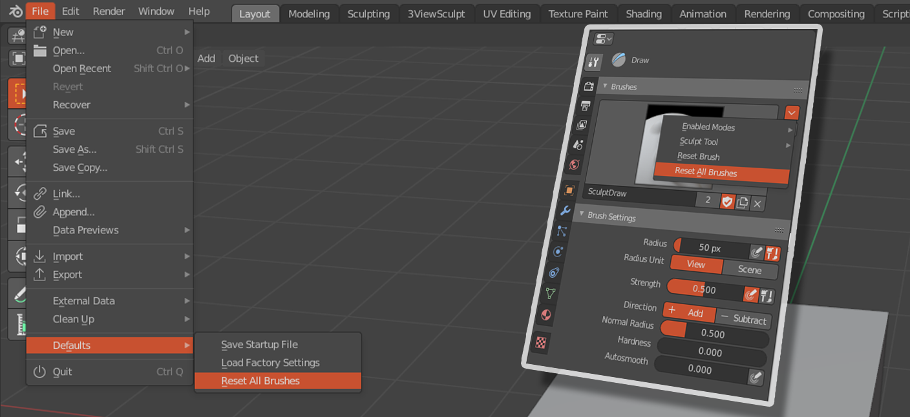

# ResetSculptBrushes

Adds a "Reset All Brushes" option to the sculpt brush property panel of <a href="https://www.blender.org">blender 2.8</a>  to reset the brush settings back to current defaults.

