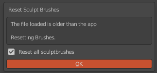

# ResetSculptBrushes 1.1.1

Adds a "Reset All Brushes" option to the sculpt brush property panel and to the filemenu of <a href="https://www.blender.org">blender 2.8</a>  to reset all brush settings back to their current defaults.

# Buy me a coffee

Hej, I offer this addon for free, but if you like it, you can support me and buy me a coffee on ko-fi. If you can't afford it, don't worry, as I said it's free. Anyway I hope you enjoy this addon. 

Stay healthy!

Thanky you! 

# Installation

- Use "clone or download" to download 
- Extract the python file (.py) from the zip archive 
- Install the extracted python file within blender  (Edit Menu -> Preferences -> Addons)
- Activate "Sculpt: ResetSculptBRushes"

# Preferences

# What's New

Updated to 1.1.1

- Custom Brush Reset Protection Mechanism
  -  Its now possible to exclude custom brushes from being reset too, by changing their name to start with underscore "_"

Updated to 1.1.0

- General Improvements and better UI Feedback
- Variants introduced for the optional AutoReset Mode
	- Silently Resetting after BlendFile loading
	- Silently Resetting after loading Blendfile if it might be outdated
		- Compares Blenders Build Date with the Filedate and just resetting if the File is outdated
	- Dialog on load if BlendFiles might be outdated
		- Compares Blenders Build Date with the Filedate and just resetting if the File is outdated
		- Note: Clicking anywhere on screen closes the dialog without causing brushresets
		- 
		   
