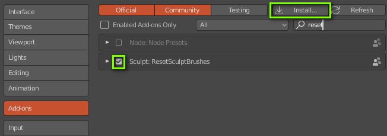
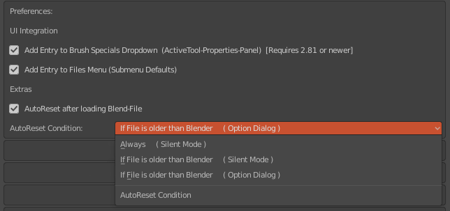

# ResetSculptBrushes 1.0.4

Adds a "Reset All Brushes" option to the sculpt brush property panel and to the filemenu of <a href="https://www.blender.org">blender 2.8</a>  to reset all brush settings back to their current defaults.

# Installation

- Use "clone or download" to download 
- Extract the python file (.py) from the zip archive 
- Install the extracted python file within blender  (Edit Menu -> Preferences -> Addons)
- Activate "Sculpt: ResetSculptBRushes"

# Preferences

